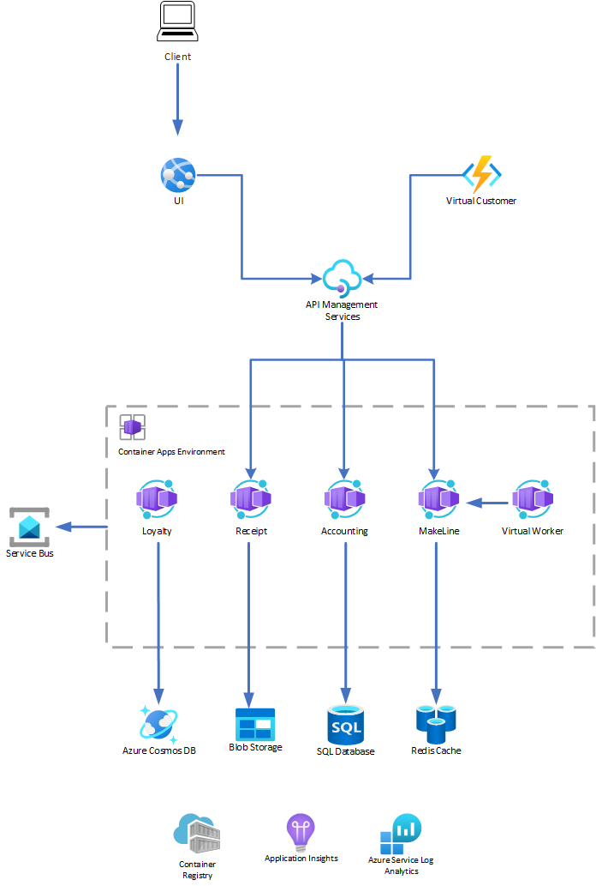
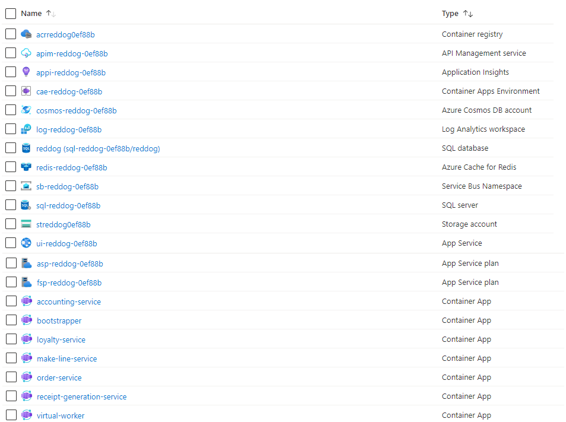
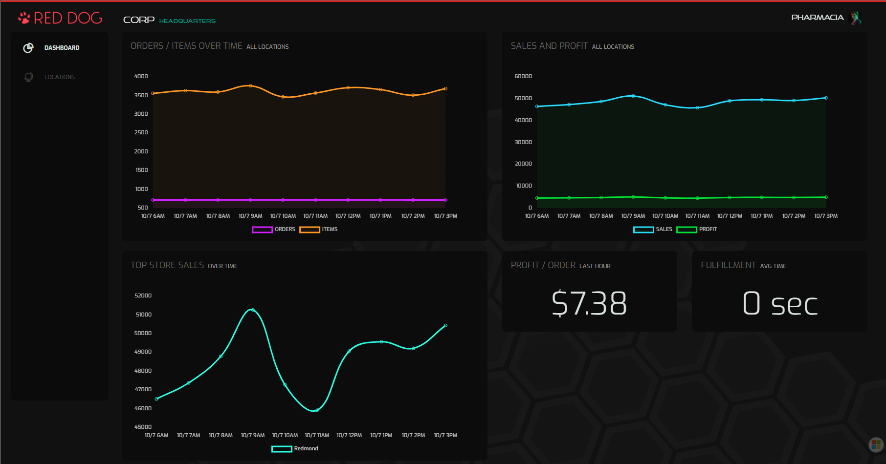

# Red Dog Demo: Azure Container Apps, Azure App Service, Azure Functions, and Azure API Management

This repository leverages the [Reddog codebase](https://github.com/Azure/reddog-code) and the [Reddog Container Apps](https://github.com/Azure/reddog-containerapps) bicep modules. It was created to help users deploy a comprehensive, microservice-based sample application to [Azure Container Apps](https://azure.microsoft.com/services/container-apps/), [Azure App Service](https://azure.microsoft.com/products/app-service/), [Azure Functions](https://azure.microsoft.com/products/functions/), and [Azure API Management](https://azure.microsoft.com/products/api-management/).

## Features

This project framework provides the following features:

- The User Interface (UI) is hosted in [Azure App Service](https://azure.microsoft.com/products/app-service/), a fully managed service for creating enterprise-ready web and mobile apps for any platform or device quickly and easily with built-in infrastructure maintenance, security patching, and scaling.
- Virtual Customers are hosted in [Azure Functions](https://azure.microsoft.com/products/functions/), a serverless computing service for creating event-driven, scalable serverless applications in .NET, Node.js, Python, Java, or PowerShell.
- The rest of the micro services are hosted in [Azure Container Apps](https://azure.microsoft.com/services/container-apps/), a fully managed, serverless container service used to build and deploy modern apps at scale. 
- Integration between the UI, Virtual Customers, and Container Apps is handled by [API Management](https://azure.microsoft.com/products/api-management/), a hybrid, multicloud management platform for APIs across all environments.

## Architecture

Below is the architecture  deployed in this demonstration.



- **[Azure App Service](https://learn.microsoft.com/azure/app-service/overview)** is a fully managed HTTP-based service that builds, deploys, and scales web apps. .NET, .NET Core, Java, Ruby, Node.js, PHP, and Python are all supported. Applications can run and scale in either Windows or Linux-based environments. 

- **[Azure Functions](https://azure.microsoft.com/services/functions)** is a serverless solution that allows you to focus more on blocks of code that can be executed with minimal infrastructure management. Functions can be hosted in [various hosting plans](/azure/azure-functions/functions-scale), whereas this reference architecture uses the premium plan, due to the use of private endpoints.

- **[Azure API Management](https://azure.microsoft.com/services/api-management)** is a managed service that allows you to manage services across hybrid and multi-cloud environments. API management acts as a facade to abstract the backend architecture, and it provides control and security for API observability and consumption for both internal and external users.

- **[Azure Container Apps](https://azure.microsoft.com/services/container-apps)** is a fully managed, serverless container service used to build and deploy modern apps at scale. In this solution, you're hosting microservices on Azure Container Apps and deploying them into a single Container App environment. This environment acts as a secure boundary around the system.

### Additional Azure Services

- **[Azure resource groups](https://learn.microsoft.com/azure/azure-resource-manager/management/manage-resource-groups-portal)** are logical containers for Azure resources. You use a single resource group to structure everything related to this solution in the Azure portal.

- **[Azure Container Registry](https://azure.microsoft.com/products/container-registry/)**, a registry of Docker and Open Container Initiative (OCI) images, with support for all OCI artifacts

- **[Azure Service Bus](https://azure.microsoft.com/services/service-bus)** is a fully managed enterprise message broker complete with queues and publish-subscribe topics. In this solution, use it for the Dapr pub/sub component implementation. Multiple services use this component. The order service publishes messages on the bus, and the Makeline, accounting, loyalty, and receipt services subscribe to these messages.

- **[Azure Cosmos DB](https://azure.microsoft.com/services/cosmos-db)** is a NoSQL, multi-model managed database service. Use it as a Dapr state store component for the loyalty service to store customer's loyalty data.

- **[Azure Cache for Redis](https://azure.microsoft.com/services/cache)** is a distributed, in-memory, scalable managed Redis cache. It's used as a Dapr state store component for the Makeline Service to store data on the orders that are being processed.

- **[Azure SQL Database](https://azure.microsoft.com/products/azure-sql/database)** is an intelligent, scalable, relational database service built for the cloud. Create it for the accounting service, which uses [Entity Framework Core](/ef/core/) to interface with the database. The Bootstrapper service is responsible for setting up the SQL tables in the database, and then runs once before establishing the connection to the accounting service.

- **[Azure Blob Storage](https://azure.microsoft.com/services/storage/blobs)** stores massive amounts of unstructured data like text or binary files. The receipt service uses Blob Storage via a Dapr output binding to store the order receipts.

- **[Azure Monitor's](https://azure.microsoft.com/services/monitor) [Application Insights](/azure/azure-monitor/app/app-insights-overview)** helps developers detect anomalies, diagnose issues, and understand usage patterns. Application Insights features extensible application performance management and monitoring for live web apps. Various platforms are supported, including .NET, Node.js, Java, and Python. It supports apps that are hosted in Azure, on-premises, in a hybrid environment, or in other public clouds. Application Insights is included as part of this reference architecture, to monitor the behaviors of the deployed application.

- **[Azure Monitor's](https://azure.microsoft.com/services/monitor) [Log Analytics](/azure/azure-monitor/logs/log-analytics-overview)** allows you to edit and run log queries with data in Azure Monitor Logs, optionally from within the Azure portal. Developers can run simple queries for a set of records or use Log Analytics to perform advanced analysis. They can then visualize the results. Log Analytics is configured as part of this reference architecture, to aggregate all the monitoring logs for more analysis and reporting.

This architecture uses Azure Container Apps integration with a managed version of the [Distributed Application Runtime (Dapr)](https://dapr.io/). Dapr is an open source project that helps developers with the inherent challenges in distributed applications, like state management and service invocation.

Azure Container Apps also provides a managed version of [Kubernetes Event-driven Autoscaling (KEDA)](https://keda.sh/). KEDA lets your containers autoscale based on incoming events from external services like Azure Service Bus and Azure Cache for Redis.

## Additional Technologies

- **[GitHub Actions](https://docs.github.com/en/free-pro-team@latest/actions)** helps you automate your software development workflows from within GitHub. In GitHub Actions, a [workflow](https://docs.github.com/en/free-pro-team@latest/actions/learn-github-actions/introduction-to-github-actions) is an automated process that you set up in your GitHub repository. Each workflow is made up of individual [actions](https://docs.github.com/en/actions/learn-github-actions/introduction-to-github-actions) that run after a specific event (like a pull request) occur.

- **[GitHub Actions for Azure](https://learn.microsoft.com/azure/developer/github/github-actions)** are developed by Microsoft and designed to be used with Azure. You can see all of the GitHub Actions for Azure in the [GitHub Marketplace](https://github.com/marketplace?query=Azure&type=actions). With GitHub Actions for Azure, you can create workflows that you can set up in your repository to build, test, package, release, and deploy to Azure. GitHub Actions for Azure supports Azure services, including Azure App Service, Azure Functions, and Azure Key Vault. See [Finding and customizing actions](https://docs.github.com/en/actions/learn-github-actions/finding-and-customizing-actions) to learn more about incorporating actions into your workflows. 

- **[GitHub Reusable Workflows](https://docs.github.com/en/actions/using-workflows/reusing-workflows)** make workflows easier to maintain and allows you to create new workflows more quickly by building on the work of others, rather than copying and pasting from one workflow to another. Workflow reuse also promotes best practice by helping you to use workflows that are well designed, have already been tested, and have been proven to be effective. Your organization can build up a library of reusable workflows that can be centrally maintained.

- **[Bicep](https://learn.microsoft.com/en-us/azure/azure-resource-manager/bicep/overview)** is a domain-specific language (DSL) that uses declarative syntax to deploy Azure resources. In a Bicep file, you define the infrastructure you want to deploy to Azure, and then use that file throughout the development lifecycle to repeatedly deploy your infrastructure. Your resources are deployed in a consistent manner. Bicep provides concise syntax, reliable type safety, and support for code reuse. Bicep offers a first-class authoring experience for your [infrastructure-as-code](https://learn.microsoft.com/en-us/devops/deliver/what-is-infrastructure-as-code) solutions in Azure.


## Benefits of this Architecture Sample

### Benefits

1. Deploy [microservices](https://learn.microsoft.com/en-us/azure/architecture/microservices/) containers without needing to manage complex container orchestration infrastructure.
1. Running containerized workloads on a [serverless](https://learn.microsoft.com/en-us/dotnet/architecture/serverless/serverless-architecture) and consumption based platform that supports scale to zero.
1. Autoscaling applications based on HTTP traffic or events supported by [KEDA](https://keda.sh/).
1. Deploying APIs and exposing APIs to internal and external clients.
1. API Management provides the publishing capability for HTTP APIs, to promote reuse and discoverability. It can manage other cross-cutting concerns such as [authentication](https://learn.microsoft.com/en-us/azure/api-management/api-management-access-restriction-policies), [throughput limits](https://learn.microsoft.com/azure/api-management/api-management-sample-flexible-throttling), and [response caching](https://learn.microsoft.com/azure/api-management/api-management-howto-cache).
1. [Continuous Integration (CI)](https://learn.microsoft.com/en-us/devops/develop/what-is-continuous-integration) to produce container images and [Continuous Deployment (CD)](https://learn.microsoft.com/en-us/devops/deliver/what-is-continuous-delivery) to increase speed and reliability of deployments.
1. [Infrastructure as Code (IaC)](https://learn.microsoft.com/en-us/devops/deliver/what-is-infrastructure-as-code) avoids manual configuration and enforces consistency by representing desired environment states via well-documented code in formats such as JSON. Infrastructure deployments with IaC are repeatable and prevent runtime issues caused by configuration drift or missing dependencies.

## Getting Started

The deployment involves the following:
1. Create the resource group and Azure Container Registry.
1. Build the microservices and create the corresponding container images.
1. Push the container images to the Azure Container Registry.
1. Provision the infrastructure and deploy the microservices and configurations.

There are two deployment options:
1. Deployment script method is to provide a quick start to facilitate developer scenarios. It is the quickest way to get the solution provisioned and functioning in Azure for exploration. 
1. The DevOps method is to provide GitHub actions pipelines to support continuous deployment scenarios. 

>**NOTE**: The APIM deployment can take over an hour to complete.

### Prerequisites

1. Local bash shell with Azure CLI or [Azure Cloud Shell](https://ms.portal.azure.com/#cloudshell/)
1. Azure Subscription. [Create one for free](https://azure.microsoft.com/free/).
1. Clone or fork of this repository.

### QuickStart Option

A bash script is included for quickly provisioning a fully functional environment in Azure. The script requires the following parameters:

```
-n: The deployment name.
-l: The region where resources will be deployed.
-c: A unique string that will ensure all resources provisioned are globally unique.
```
> **NOTE:** Please refer to the [Resource Name Rules](https://learn.microsoft.com/azure/azure-resource-manager/management/resource-name-rules#microsoftweb) to learn more about globally unique resources.

Follow the steps below to quickly deploy using the bash script:

1. Clone the repository to local machine.
    ```
    git clone https://github.com/Azure-Samples/app-templates-microservices-integration.git
    ```
1. Switch to the cloned folder
    ```
    cd app-templates-microservices-integration
    ```

1. Make the bash script executable
    ```
    chmod +x ./deploy.sh
    ```

1. Login to Azure and ensure the correct subscription is selected
    ```
    az login
    az account set --subscription <subscription id>
    az account show
    ```

1. Run the script and provide required parameters
    ```
    ./deploy.sh -n demo -l eastus2 -c <unique code>
    ```

### GitHub Actions Option

GitHub workflows are included for deploying the solution to Azure.

To run the workflows, follow these steps:

1. Create three environments
    - `Production`: Commits to the `master` or `main` branch will trigger deployments to this environment.
    - `Test`: Commits to the `dev` or `develop` branch will trigger deployments to this environment.
    - `Features`: Commits to any branch under `features/` will trigger deployments to this environment.
1. Create the following secrets
    - `AZURE_CREDENTIALS`: This secret will be used by GitHub actions to authenticate with Azure. Follow the instructions [here](github.com/marketplace/actions/azure-login#configure-a-service-principal-with-a-secret) to login using Azure Service Principal with a secret.
    - `AZURE_LOCATION`: This is the Azure region where resources will be deployed
    - `AZURE_PROJECT_NAME`: This is the name that will be appended to Azure resources
    - `AZURE_UNIQUE_CODE`: This is a unique code that will be appended to Azure resources
1. Go to [Actions](../actions/)
1. Click on the `Deploy Solution` action
1. Click on `Run workflow` and select a branch

### Verifying Deployment

When the deployment completes. 

1. Navigate to the [resource group](https://learn.microsoft.com/azure/azure-resource-manager/management/manage-resource-groups-portal) in the [Azure Portal](https://portal.azure.com). You should see a list of resources that looks something like this:

    

    > **NOTE:** In the image above `0ef88b` is the unique code supplied to `deploy.sh` or stored in the `AZURE_UNIQUE_CODE` secret. 

1. Click on the UI [App Service](https://learn.microsoft.com/azure/app-service/overview) resource named `ui-reddog-<unique code>`. In the Overview tab, the URL of the User Interface is displayed as follows:

    ```
    https://ui-reddog-<unique code>.azurewebsites.net
    ```

1. Click on the URL to open up a dashboard UI. After a few minutes, the screen should look something like the screen below:

    

1. The Virtual Customer is simulating customer orders periodically. To submit an order you can use the following curl command in a bash shell to send a request to API Management.

    ```bash
    curl -X POST https://<Your APIM Gateway URL>/order/ -H 'Content-Type: application/json' -d '{"storeId": "Redmond", "firstName": "John Hannibal", "lastName": "Smith", "loyaltyId": "42", "orderItems": [{"productId": 1, "quantity": 1}, { "productId": 2, "quantity": 1}, {"productId": 3, "quantity": 3}]}'

    ```
> **NOTE:** The first time you load the dashboard, you may get a `504 - Gateway Timeout` error. Try again after a few minutes.

## Delete the Deployment

Clean up the deployment by deleting the single resource group that contains the Reddog infrastructure.

> **WARNING:** This will delete ALL the resources inside the resource group.

1. Make the bash script executable
```
chmod +x ./destroy.sh
```

1. Login to Azure and ensure the correct subscription is selected
```
az login
az account set --subscription <subscription id>
az account show
```

1. Run the script and provide required parameters
```
./destroy.sh -n demo -c <unique code>
```

> **NOTE:** The unique code provided to `destroy.sh` has to match the one provided during deployment.

## Enhancements Opportunities

Below are opportunities for enhancements. Pull requests are welcome: 

1. Restrict direct traffic to Container Apps, Azure Function, and APIM (e.g. using a VNet)
1. Use [Azure Application Gateway](https://learn.microsoft.com/azure/application-gateway/overview) to manage traffic to the Web Application. Application Gateway can be [integrated with Microsoft Defender for Cloud](https://learn.microsoft.com/azure/defender-for-cloud/partner-integration#integrated-azure-security-solutions) to prevent, detect, and respond to threats. 
1. Add [throttling](https://learn.microsoft.com/azure/api-management/api-management-sample-flexible-throttling), [caching](https://learn.microsoft.com/azure/api-management/api-management-howto-cache) policies to APIM APIs
1. Add [subscriptions](https://learn.microsoft.com/azure/api-management/api-management-subscriptions), [products](https://learn.microsoft.com/azure/api-management/api-management-howto-add-products), [authentication](https://learn.microsoft.com/azure/api-management/authentication-authorization-overview), and [authorization](https://learn.microsoft.com/azure/api-management/authorizations-overview) for API Management. 
1. Use [Azure App Configuration](https://learn.microsoft.com/azure/azure-app-configuration/overview) and [Azure Key Vault](https://learn.microsoft.com/azure/key-vault/general/overview) for configuration and secret management


## Next steps

- Other Reddog order management system implementations:
  - [Container Apps deployment](https://github.com/Azure/reddog-containerapps)
  - [Azure Arc hybrid deployment](https://github.com/Azure/reddog-hybrid-arc)
  - [AKS deployment](https://github.com/Azure/reddog-aks)
  - [Local development](https://github.com/Azure/reddog-code/blob/master/docs/local-dev.md)


## Related resources

- [Azure Container Apps docs](https://learn.microsoft.com/azure/container-apps/)
- [Deploy microservices with Azure Container Apps](https://learn.microsoft.com/azure/architecture/example-scenario/serverless/microservices-with-container-apps)
- [Deploy microservices with Azure Container Apps and Dapr](https://learn.microsoft.com/azure/architecture/example-scenario/serverless/microservices-with-container-apps-dapr)
- [Integration architecture design](https://learn.microsoft.com/en-us/azure/architecture/integration/integration-start-here)
- [Azure Container Apps docs](/azure/container-apps)

## Contributing

This project welcomes contributions and suggestions.  Most contributions require you to agree to a
Contributor License Agreement (CLA) declaring that you have the right to, and actually do, grant us
the rights to use your contribution. For details, visit https://cla.opensource.microsoft.com.

When you submit a pull request, a CLA bot will automatically determine whether you need to provide
a CLA and decorate the PR appropriately (e.g., status check, comment). Simply follow the instructions
provided by the bot. You will only need to do this once across all repos using our CLA.

This project has adopted the [Microsoft Open Source Code of Conduct](https://opensource.microsoft.com/codeofconduct/).
For more information see the [Code of Conduct FAQ](https://opensource.microsoft.com/codeofconduct/faq/) or
contact [opencode@microsoft.com](mailto:opencode@microsoft.com) with any additional questions or comments.